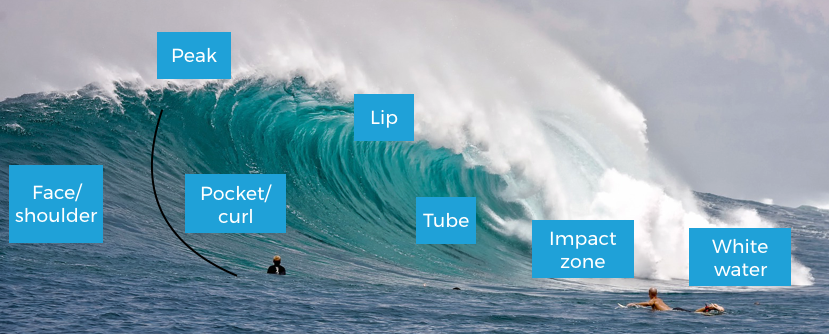

# Wave Detection for Surfing with Computer Vision

## Introduction
This project uses machine learning to find the “pocket” of a wave — the best spot on a breaking wave where a surfer can go the fastest and stay in control. It works by analyzing surf footage, frame by frame, to predict where this pocket is. The idea comes from something surfers often do on the beach called “mind surfing,” where they watch the waves and imagine how they would ride them, choosing the best line without actually getting in the water.

  
*Source: [GoSurf Perth](https://www.gosurfperth.com/blog/2018/5/6/wave-anatomy)*

In the diagram above, the "pocket" refers to the steep, powerful zone just ahead of where the wave breaks. This is where surfers aim to stay for optimal performance — and the region that this model is trained to detect.

## Features
- **Frame Extraction**: Converts MP4 clips to 1 fps frames (1280×720) via FFmpeg.  
- **Annotation**: Batch-uploaded frames to Roboflow and drew bounding boxes on 2,077 images (~1,200 pockets).  
- **Data Splits**: Random 70/20/10 train/validation/test split, with an expandable Streamlit explainer.  
- **Model Training**: Fine-tuned YOLOv8-nano (`yolov8n.pt`) for 40 epochs (early stopping patience = 10) on 512×512 crops, batch size = 16.  
- **Performance Analysis**: Interactive dropdown in Streamlit to explore confusion matrix, F1-confidence, precision-confidence, precision-recall (mAP@0.5), and recall-confidence curves.  
- **Real-Time Inference**: Live demo on unseen video showing accurate pocket detection (left/right) with autoplay & loop.  
- **Limitations & Future Work**: Data-volume biases highlighted, plus proposed enhancements and surf-coaching applications.
